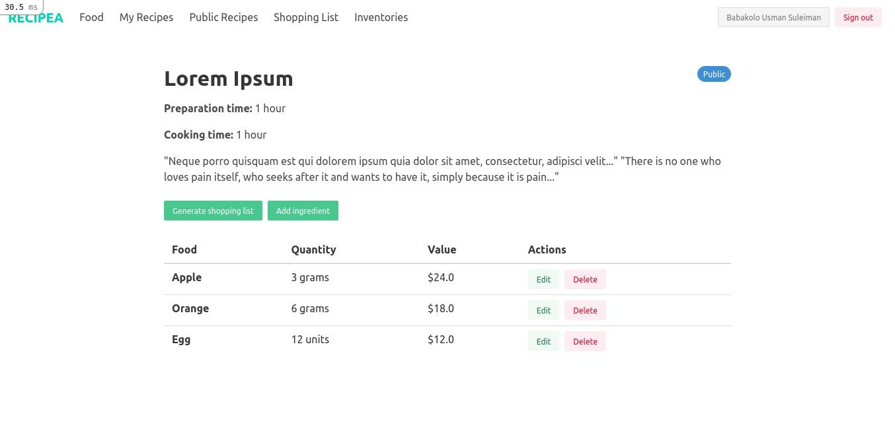

# Recipe App


> The Recipe app keeps track of all your recipes, ingredients, and inventory



The Recipe app keeps track of all your recipes, ingredients, and inventory. It will allow you to save ingredients, keep track of what you have, create recipes, and generate a shopping list based on what you have and what you are missing from a recipe. Also, since sharing recipes is an important part of cooking the app should allow you to make them public so anyone can access them.

## Built With

- Ruby on Rails
- PostgreSQL
- Bulma CSS

## Getting Started

To get a local copy up and running follow these simple example steps.

### Prerequisites

- [Ruby](https://www.ruby-lang.org/en/)
- [Rails](https://gorails.com/)

### Setup

- Make sure you have Ruby on Rails set up properly on your computer
- Clone or download this repo on your machine
- Enter project directory

### Install

```sh
bundle install
```

### Database

```sh
# Create user
sudo -u postgres createuser recipe_app -s

# Create the database
rails db:create

## Apply migration
rails db:migrate

# Load the schema
rails db:schema:load
```

### Run

```sh
rails s
```

### Troubleshoot

```sh
### Rspec failing
RAILS_ENV=test rake db:reset
```

```sh
### New Scaffold
rails g scaffold_controller model
```

```sh
### Undo migration
rake db:migrate VERSION=0
```

## Authors

👤 **Usman**

- GitHub: [@usmansbk](https://github.com/usmansbk)
- LinkedIn: [Usman Suleiman Babakolo](https://linkedin.com/in/usmansbk)

👤 **Abraham**

- GitHub: [@Metsanpeitto](https://github.com/Metsanpeitto)
- LinkedIn: [Abraham R](https://www.linkedin.com/in/abraham-rodriguez-3283a319a/)

## 🤝 Contributing

Contributions, issues, and feature requests are welcome!

Feel free to check the [issues page](../../issues/).

## Show your support

Give a ⭐️ if you like this project!

## Acknowledgments

- Microverse

## License

[MIT](./LICENSE)
